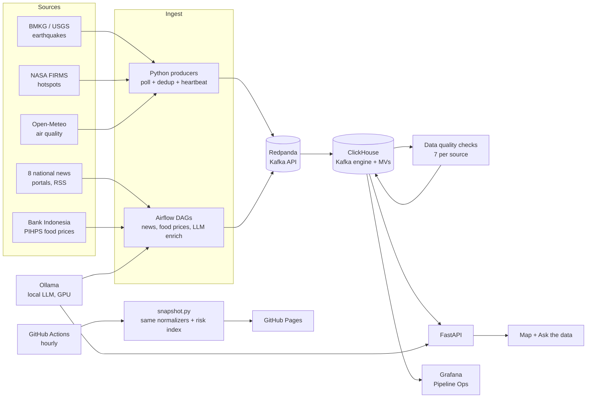

# Indonesia Realtime Monitor

An end-to-end data platform that ingests public Indonesian data in near real time (earthquakes, wildfire hotspots,
air quality, food prices, and disaster news), checks its quality continuously, scores risk per regency, and lets
people ask questions about it in plain Indonesian through a local LLM.

**Live demo (free, rebuilt hourly):** https://elsonsaputra03-dot.github.io/indo-realtime-monitor/demo.html
**Portfolio:** https://elsonsaputra03-dot.github.io/indo-realtime-monitor/

<!-- Screenshots: save PNGs to docs/img/ and uncomment.


| Ask the data | Follow-up question |
|---|---|
|  |  |

| Pipeline Ops (Grafana) | Airflow |
|---|---|
|  |  |
-->

> Built by [Elson Saputra](https://www.linkedin.com/in/elson-saputra-4960ba82), Data Engineer. Personal project; not affiliated
> with any data provider. The risk index is experimental and is **not** an official hazard assessment (see BNPB InaRISK).

---

## Two ways it runs

| | Public demo | Full platform |
|---|---|---|
| Where | GitHub Pages | One machine, Docker Compose |
| Cost | $0 | Your hardware |
| Freshness | Hourly (GitHub Actions) | Seconds to minutes |
| Includes | Map, risk index, source status | Everything: Kafka, ClickHouse, Airflow, data quality, Grafana, local LLM, Q&A |

The public demo reuses the same normalizers as the streaming producers, so both paths parse data identically.

## Architecture



## What it does

- **Streaming ingestion.** Producers poll BMKG, USGS, NASA FIRMS and Open-Meteo, normalize to one schema, deduplicate with a
  seen-cache seeded from ClickHouse, and publish to Redpanda. Every run emits a heartbeat record used for monitoring.
- **Batch scraping with Airflow.** RSS from 8 national portals (robots.txt checked per host, rate-limited, headline + short
  summary + link only) and daily food prices for 10 commodities across 34 provinces from Bank Indonesia's PIHPS.
- **Storage.** ClickHouse Kafka engine tables feed materialized views into `ReplacingMergeTree` tables with TTLs; queries use
  `FINAL` for exact results.
- **Data quality.** For every source: freshness, run error rate, 24h volume, validity rules, duplicate ratio, and event lag,
  with warn/fail thresholds tuned per source. Results land in ClickHouse and in a Grafana dashboard.
- **LLM enrichment.** A 3B model on a 4 GB laptop GPU (Ollama) classifies news topics and extracts place names.
  **Coordinates never come from the model**: names are resolved against a gazetteer of 38 provinces and 514 regencies,
  with alias handling (e.g. *Kotim* → Kotawaringin Timur) and a mountain table (e.g. *Rinjani* → Lombok Timur).
- **Ask the data.** Tool calling, not text-to-SQL. The model picks from six predefined, parameterized queries; parameters it
  invents that are not in the question are dropped; answers are built on deterministic fact sentences that are shown next to
  every AI answer.
- **Risk index.** A composite 0–100 score per regency from hotspot density, nearby earthquakes, air quality, disaster news,
  and food-price anomalies, with a per-component breakdown for every regency.

## Engineering log: real issues found and fixed

Most of the design came from things that broke. Each was detected by a check, a test, or the data itself.

| # | What happened | How it was caught | Fix |
|---|---|---|---|
| 1 | Hotspot source failed on every run | DQ: freshness + run error rate turned red | Misconfigured API key (a placeholder value) |
| 2 | Public status page could have exposed the API key in an error URL | Code review of a failing run | Redact secrets and URLs from every public message |
| 3 | Duplicate ratio reached 66.7% after restarts | DQ: duplicate ratio | Seed the producer's seen-cache from ClickHouse on start |
| 4 | Event lag of ~8,500 minutes on a healthy source | DQ: event lag | First-run backfill; lag now measured on recently ingested records only |
| 5 | Zero hotspots in the early UTC hours | Manual check vs. the API | The API's day range is a UTC calendar date; request two days |
| 6 | Food-price fetch failed only inside the scheduler | Reproduced inside the container | The server returns double-encoded JSON when `Accept: application/json`; decode twice |
| 7 | Google News feeds skipped | Scraper's robots.txt check | Respected; replaced with 8 portals verified by a feed-check script |
| 8 | "OKI" resolved to the province, not the regency | LLM evaluation | Source gazetteer had 3 truncated names; cross-checked against a second table |
| 9 | 24 of 514 regency polygons were wrong: 20 by area (one city at 44× its official area, two at zero) and 4 island regencies shifted far from their capitals | Area check + capital-within-40-km check | Replace with an area-equivalent circle at the capital and flag on the map |
| 10 | A regency capital was plotted in Africa | Same position check | Source typo in longitude (23.5 instead of 123.5); corrected and documented |
| 11 | The LLM copied "Jakarta" from a prompt example into unrelated questions | Response debug field | Few-shot examples rewritten; parameters must appear in the question |
| 12 | A small model misread counts ("highest is 993" instead of "993 hotspots") | Manual review of answers | Tools emit deterministic fact sentences; the model only phrases them |
| 13 | DQ check for the LLM table errored | The Q&A assistant reported it when asked about pipeline health | Per-source ingest-time column in the DQ config |

## Quickstart (full platform)

Requirements: Docker with Compose v2, ~12 GB RAM for everything (less without the LLM), optional NVIDIA GPU.

```bash
git clone https://github.com/elsonsaputra03-dot/indo-realtime-monitor.git
cd indo-realtime-monitor
cp .env.example .env            # set passwords and FIRMS_MAP_KEY (free: firms.modaps.eosdis.nasa.gov/api/map_key)
make up && make migrate         # Redpanda, ClickHouse, producers, DQ, API, Grafana
make batch-up                   # Airflow: news, food prices, LLM enrichment
make llm-up && make llm-pull    # Ollama + model (optional)
make smoke && make urls
```

Open `http://localhost:8000` (map) and `http://localhost:8000/tanya.html` (ask the data).
A detailed step-by-step build guide in Indonesian is in [docs/BUILD_GUIDE_ID.md](docs/BUILD_GUIDE_ID.md).

## Repository layout

```
app/                 producers, data quality checks, FastAPI (incl. ask-the-data)
airflow/dags/        news_ingest, food_price_ingest, news_enrich + helpers (llm_lib, news_lib, pihps_lib)
clickhouse/init/     schemas, Kafka engine tables, materialized views
reference/           gazetteer (38 provinces, 514 regencies) and boundary polygons, with QC notes
scripts/             snapshot.py + risk.py (public demo), eval_llm.py (LLM evaluation)
site/                static portfolio + demo (GitHub Pages)
web/                 full-platform UI (map, chat)
grafana/             datasource provisioning + Pipeline Ops dashboard
```

## Data sources and attribution

| Data | Source | Notes |
|---|---|---|
| Earthquakes | BMKG, USGS Earthquake Hazards Program | Public feeds |
| Wildfire hotspots | NASA FIRMS (VIIRS NRT) | Free API key required |
| Air quality | Open-Meteo Air Quality API | Model-based estimates for 38 provincial capitals |
| Food prices | PIHPS Nasional, Bank Indonesia | Traditional markets; robots.txt permits; fetched twice daily |
| News | 8 Indonesian national portals (RSS) | Headlines, short summaries and links only |
| Boundaries & gazetteer | [cahyadsn/wilayah](https://github.com/cahyadsn/wilayah) (MIT) | See reference/README.md for QC corrections |
| Basemap | © OpenStreetMap contributors | |

## Limitations

- The public demo is a static snapshot updated hourly, and it does not include the LLM features.
- Air quality and food prices are province-level proxies inside a regency-level index.
- The risk index weights are hand-chosen for demonstration; they are not calibrated against historical events.
- News geotagging resolves to regency capitals, not exact incident locations.
- LLM quality numbers are only reported after a manual evaluation on fresh, unseen articles
  (see [docs/eval](docs/eval)); development samples are not used as evidence.

## License

Code: MIT (see [LICENSE](LICENSE)). Data remains subject to each provider's terms.
